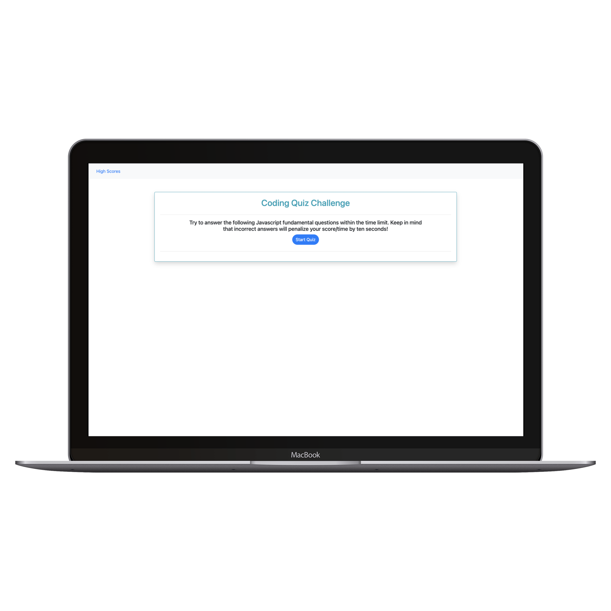

# Code Quiz

# Description 

A timer-based quiz application having multiple choice questions that stores high scores of multiple users. Answering incorrectly results in penality of time.

## Deployed Website : 
[Code Quiz](https://gaurikhandke.github.io/Gauri-code-quiz/)

# Table of Contents
* [Demo](#demo)
* [Technology](#technology)
* [Usage](#usage)
* [Features](#features)
* [License](#license)
* [Contribution](#contribution)
* [Questions](#questions)

# Motivation

In hiring process or in any exam, candidate is asked to complete multiple choice questions assessment.

# Demo : 

# Screenshots

|Medium Devices/ Laptop|Small Devices/ Tablet|Extra Small Devices/Phone
|--|--|--
|||

# Technology: 

#### [Javascript](https://developer.mozilla.org/en-US/docs/Web/JavaScript): 
* JavaScript is a cross-platform, object-oriented scripting language used to make webpages interactive.
* JavaScript(JS) is a lightweight, interpreted, or just-in-time compiled programming language with first-class functions. 
* With the HTML DOM, JavaScript can access and change all the elements of an HTML document.

#### [Bootstrap](https://getbootstrap.com/) : 

* Bootstrap is a free and open-source CSS framework directed at responsive, mobile-first front-end web development. It contains CSS and (optionally) JavaScript-based design templates for typography, forms, buttons, navigation, and other interface components.

# Usage : 

1. On a start page, user can start quiz by pressing 'Start Quiz' button, which starts quiz by initializing timelimit for quiz.

2. When quiz starts, user is presented with question and four choices to choose correct answer. When user selects answer, user can see if the given answer is correct or wrong.

3. If choosen answer is wrong, their is a time penalty of ten seconds. i.e ten seconds are reduced from remaining time.

4. When quiz ends or when remaining time reaches zero, user is presented his final score and he is asked to provide name to store in highscores.

5. When user submits his name when quiz completed, his name and score is stored and highscores of all users is shown.

6. User can view previous highscores of users from 'Highscores' link on start page.
 

# Features : 

1. Responsive Web Design : Application provides Responsive web design so that it adapts to multiple screen sizes. Bootstrap is used to provide responsive functionality.

2. HTML DOM is used to create html elements dynamically.

3. Event listeners are used for events such as 'click'.

4. Users scores are stored on client side storage such as 'localStorage' of web browser.

5. Timer starts when quiz starts. Timer stops when quiz is completed or when timer reaches zero and final score is shown.

# License

This project is licensed under MIT License.

# Contribution

Please let me know how I can improve this project. Issues and pull requests are always welcome.

# Questions :
* If you have any questions about the repo, please submit issue [here](https://github.com/GauriKhandke/Gauri-code-quiz/issues/new) or [email](mailto:khandkegauri@gmail.com) me.
